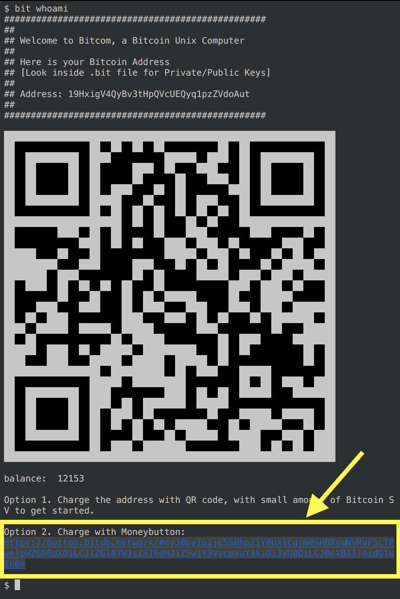

# 0.1.0 Release Note

## Feature Additions

### 1. cat

Add support for `cat`, allowing assignment of files to attributes

```
cat bit://19HxigV4QyBv3tHpQVcUEQyq1pzZVdoAut/e55fed7fe709567f7b4191c180c91a7bae8b354b091d9653f2512ca51738734a to readme
```

### 2. route

Add support for [bit://](https://bit.planaria.network)

#### a. enable

- Enable means effectively opening up the specified protocol route for any service provider to implement.
- Only the admin can enable a route.

Syntax

```
OP_RETURN $ route enable [ROUTE_MATCHER]
```

Example

```
OP_RETURN $ route enable /tx/:tx
```

#### b. add

- `add` means plugging in a service endpoint to bitcoin protocols
- Any service provider can add their endpoint to a route.
- But there may be another step to make sure the added endpoint actually is affiliated with the Bitcom address, through schemes such as [Bitcoin Sticker Protocol](https://sticker.planaria.network).
- should block if the admin tries to add a route. A separate account (for service providers) must be created to add a route. The admin should only enable routes.

Syntax

```
OP_RETURN $ route add [BITCOM_ADDRESS] [ROUTE_MATCHER] [ENDPOINT_TEMPLATE]
```

Example

```
OP_RETURN $ route add 19HxigV4QyBv3tHpQVcUEQyq1pzZVdoAut /:tx https://media.bitcoinfiles.org/${tx}
```

#### Route Matcher

Both the `route enable` and `route add` utilizes the route matcher pattern. Here's what they can look like:

| Example       | Description                                                                                                      |
| ------------- | ---------------------------------------------------------------------------------------------------------------- |
| `:tx`         | a param to capture from the route up to `/`, `?`, or end of string                                               |
| `*splat`      | a splat to capture from the route up to `?` or end of string                                                     |
| `()`          | Optional group that doesn't have to be part of the query. Can contain nested optional groups, params, and splats |
| anything else | free form literals                                                                                               |

Eamples:

- `/some/(optional/):thing`
- `/users/:id/comments/:comment/rating/:rating`
- `/*a/foo/*b`
- `/books/*section/:title`
- `/books?author=:author&subject=:subject`

> NOTE: The ruleset is from https://github.com/rcs/route-parser/blob/master/README.md

#### Endpoint Template

The endpoint template takes the matched variable and instantiates it into the final static URI form.

For example, the following expression takes the matched variable `tx` from the route matcher, and instantiates the endpoint url template `https://media.bitcoinfiles.org/${tx}`.

```
OP_RETURN $ route add 19HxigV4QyBv3tHpQVcUEQyq1pzZVdoAut /:tx https://media.bitcoinfiles.org/${tx}
```

### 3. Charge with MoneyButton

In addition to QR code, you can now charge your Bitcom wallet using [ButtonPage](https://button.bitdb.network).



## Refactor

Organized all commands into `bin` folder.
