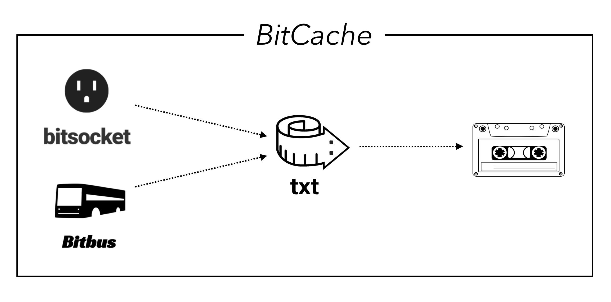
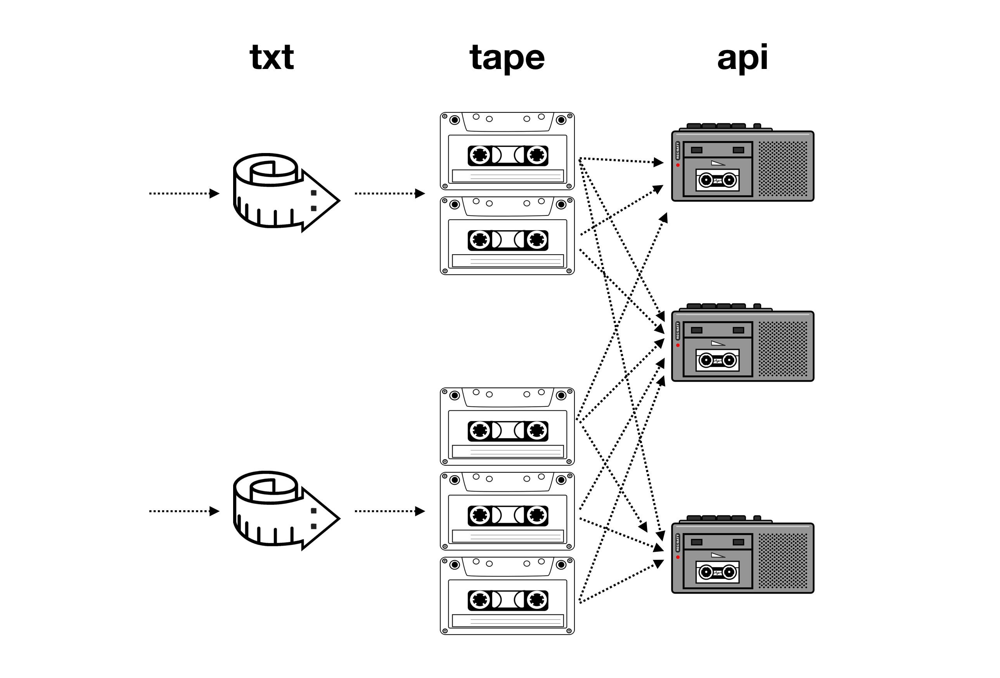
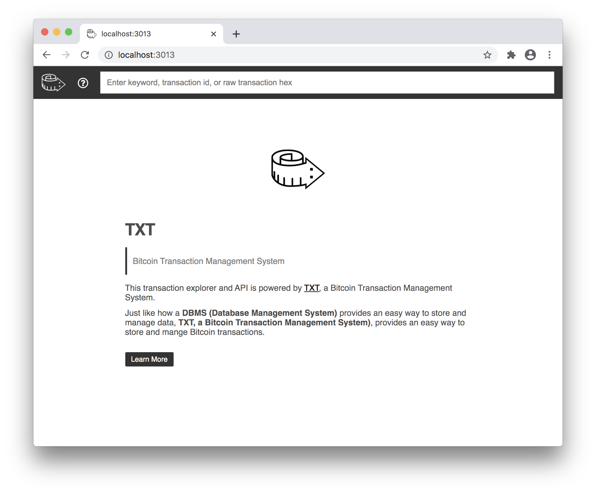
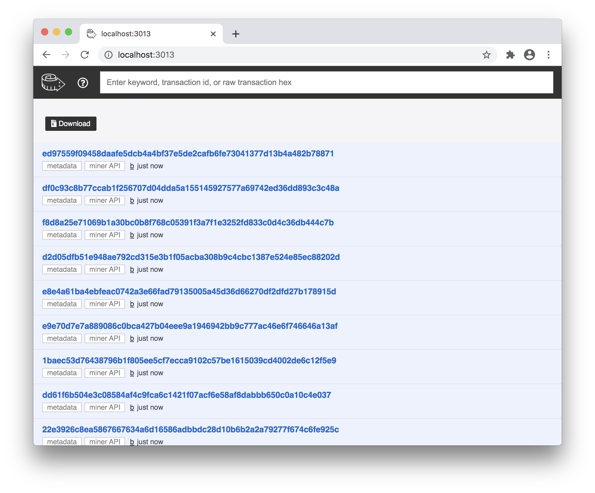
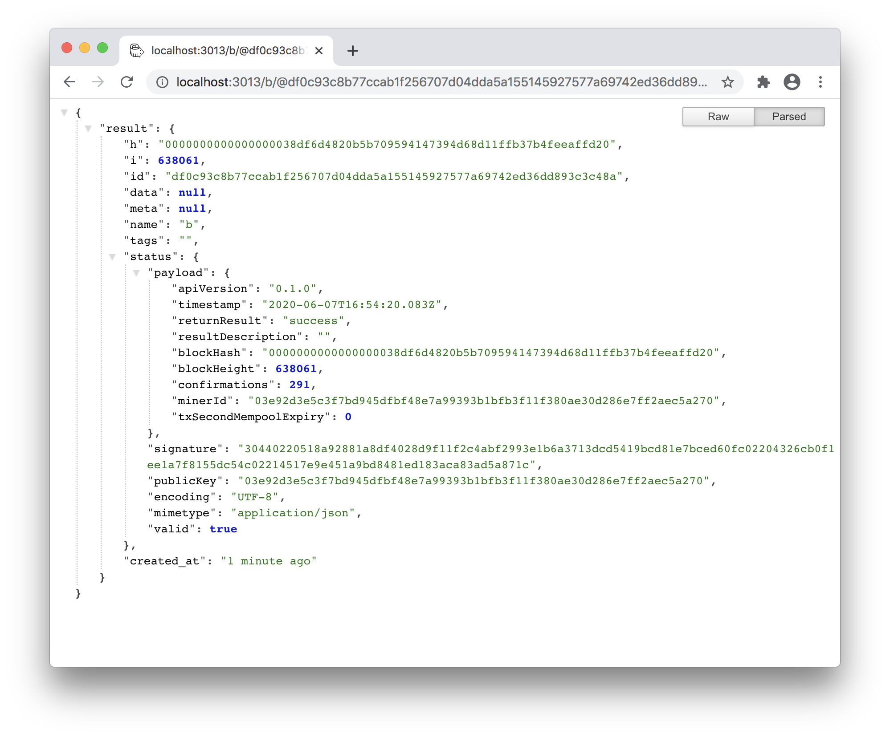
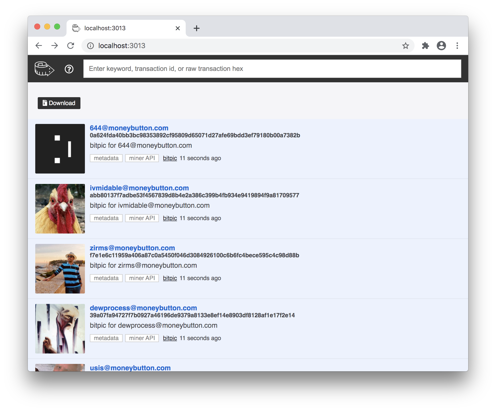
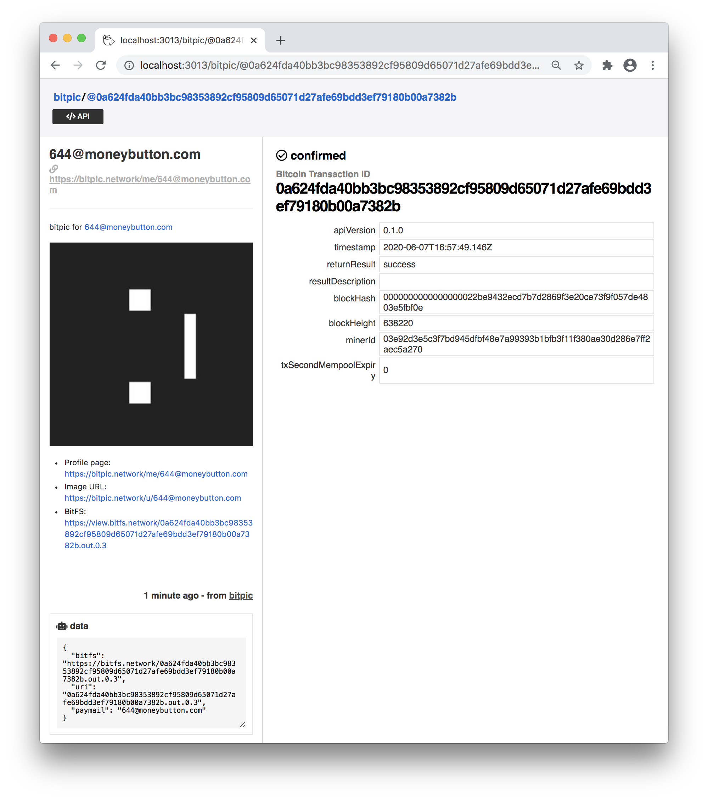

# Bitcache

> A Peer-to-Peer Cache System for Bitcoin

## 1. Bitcoin Cache System



Bitcache lets you cache a filtered and processed version of the bitcoin blockchain data. First, quick intro:

1. [Bitbus](https://bitbus.network): Bitbus lets you crawl the blockchain for various filtered transaction patterns you're looking for using a simple query language named Bitquery.
2. [Bitsocket](https://bitsocket.network): Bitsocket lets you listen to realtime transaction events on the Bitcoin P2P network as they happen using Bitquery.
3. [TXT](https://txt.network): TXT is a versatile bitcoin transaction storage system which lets you cache bitcoin transactions along with semantic metadata.

Bitcache integrates all 3 components, making it easy to stream Bitbus and Bitsocket data to TXT with a simple declarative syntax.

## 2. Peer to Peer



Bitcache creates **a [TXT tape](https://txt.network/#/?id=_2-components), a single self-contained portable SQLite file**, which can be opened by any SQLite client, can be hosted and served by any TXT client, and can be shared in a distributed manner.

Because the portable TXT tape encapsulates an entire API stack in a single portable file, the API can be easily shared and replicated in a peer to peer manner.

You can archive or pass it around easily, such as through USB drives, email attachments, BitTorrent, etc. After all, it's just a single file.

---

# Demo

Check out some examples powered by bitcache

## 1. C.txt

C.txt is a cache for storing [B://](http://b.bitdb.network) file metadata (not the file itself), along with content addressable file hash, powered by [C:](https://c.bitdb.network).

You can use this as a search engine for finding files on the blockchain through metadata instead of just transaction IDs.

<a href='https://c.planaria.network' class='btn'>Check out C.txt</a>

## 2. Bitpic.txt

Bitpic.txt is a cache for [Bitpic](https://bitpic.network) protocol. The actual images are sourced from [Bitfs](https://bitfs.network), and Bitpic.txt indexes and caches the metadata.

<a href='https://txt.bitpic.network' class='btn'>Check out bitpic.txt</a>

---

# Quickstart

## 1. Install Docker

bitcache is powered by [TXT](https://txt.network). Therefore you need to install Docker (and optionally docker-compose) first.

Learn how to install: https://txt.network/#/?id=_1-install-docker

## 2. Start TXT

let's first create a folder to store the cache, and start TXT.

```
mkdir bcache && cd bcache
curl https://txt.network/docker-compose.yml > docker-compose.yml && docker-compose up -d
```

Now, visit http://localhost:3013 and make sure the screen looks like this:



if you see this sceen, you're all good to go!

## 3. Run Bitcache

Once you have TXT up and running, you can write to it. Let's write some JavaScript code. First install `bitcache`.

```
npm install --save bitcache
```

### Example1: B.txt

In this first example we are going to create a minimal transaction ID bundle for all [B:// protocol](https://b.bitdb.network) transactions.

Let's create a file named `b.js`.

```javascript
const bitcache = require('bitcache')
const query = {
  "q": {
    "find": {
      "out.s2": "19HxigV4QyBv3tHpQVcUEQyq1pzZVdoAut",
      "out.f3": { $exists: true }
    },
    "project": { "out.f3": 1, "tx.h": 1 },
    "limit": 100
  }
}
bitcache.init({
  socket: {
    url: "https://txo.bitsocket.network",
    query: query,
  },
  bus: {
    from: 638000,
    url: "https://txo.bitbus.network",
    token: <YOUR PLANARIA TOKEN GOES HERE>,
    query: query,
  },
  txt: {
    channel: "b",
    url: "http://localhost:3013",
  },
})
```

Notice the `bus.token` needs to be filled out with your own Planaria token, so let's do that.

Go to https://token.planaria.network/ and press the "Get token" button to get a token. Write it down somewhere, and paste that token in the code.

Now run:

```
node b
```

Go back to http://localhost:3013 and you'll find that your TXT has been populated with Transaction IDs only:



This is the most minimal version of TXT you can store. You can check the API result by clicking one of the entries and clicking an "API" button at the top, which should display something like this:



> Only storing transaction IDs is useful if you want to own the entire contextual bundle of transactions without having to rely on a filter forever.

### Example2: Bitpic.txt

Now, how about we add some more flesh to the basic structure? Let's try adding some metadata to transactions.

This time let's try a different protocol example. We will try [Bitpic](https://bitpic.network).

Create a file named `bitpic.js` and paste the following code:

```javascript
const bitcache = require('bitcache')
const query = {
  "q": {
    "find": { "out.tape.cell.s": "18pAqbYqhzErT6Zk3a5dwxHtB9icv8jH2p" },
    "project": { "out.tape.cell.s": 1, "out.tape.cell.f": 1, "tx.h": 1 },
    "limit": 100
  }
}
const transform = async (o) => {
  let out = o.out
  return {
    meta: {
      title: out[0].tape[2].cell[1].s,
      content: "bitpic for " + out[0].tape[2].cell[1].s + "\n\n  \n\n- Profile page: https://bitpic.network/me/" + out[0].tape[2].cell[1].s + "\n- Image URL: https://bitpic.network/u/" + out[0].tape[2].cell[1].s + "\n- BitFS: https://view.bitfs.network/" + out[0].tape[1].cell[1].f,
      link: "https://bitpic.network/me/" + out[0].tape[2].cell[1].s,
      image: "https://x.bitfs.network/" + o.tx.h + ".out.0.3",
      description: "bitpic for " + out[0].tape[2].cell[1].s
    },
    data: {
      bitfs: "https://bitfs.network/" + out[0].tape[1].cell[1].f,
      uri: out[0].tape[1].cell[1].f,
      paymail: out[0].tape[2].cell[1].s,
    }
  }
}
bitcache.init({
  txt: {
    channel: "bitpic",
    url: "http://localhost:3013",
  },
  socket: {
    url: "https://bob.bitsocket.network",
    query: query,
    transform: transform
  },
  bus: {
    url: "https://bob.bitbus.network",
    token: <YOUR PLANARIA TOKEN GOES HERE>,
    query: query,
    transform: transform
  }
})
```

Now, run:

```
node bitpic
```

Go back to the browser at http://localhost:3013 and you will see:



Check out how the data is stored by clicking one of the items:



To learn mmore about how all this layout works automatically, check out https://txt.network/#/?id=_1-write

> **Note that the `txt.channel` attribute is set to `"bitpic"` this time (the first example had it set as `"b"`) therefore everything has been posted to the [bitpic channel](http://localhost:3013/bitpic).**

## 4. Do not use "limit"

In the examples above, the queries included an attribute named "limit", which is used to limit the number of items returned by the endpoints. But this was just for demo, and now that you know how it works, you should NOT use the "limit" attribute in your apps. Here's why:

1. In the demo we used it only for showing what's possible without crawling everything (only crawl 100).
2. In most cases you probably want to filter ALL transactions that match your condition, not just 100.

So instead of

```javascript
const bitcache = require('bitcache')
const query = {
  "q": {
    "find": {
      "out.s2": "19HxigV4QyBv3tHpQVcUEQyq1pzZVdoAut",
      "out.f3": { $exists: true }
    },
    "project": { "out.f3": 1, "tx.h": 1 },
    "limit": 100
  }
}
...
```

you should use

```javascript
const bitcache = require('bitcache')
const query = {
  "q": {
    "find": {
      "out.s2": "19HxigV4QyBv3tHpQVcUEQyq1pzZVdoAut",
      "out.f3": { $exists: true }
    },
    "project": { "out.f3": 1, "tx.h": 1 }
  }
}
...
```

So how do you limit how much to crawl? You can use the [from](#_1-syntax) attribute to set the block height to crawl from (used by Bitbus).

## 5. What Next?

Bitcache is a library which interacts with Bitbus, Bitsocket, and TXT. So you may want to learn how each works in order to take advantage of its full power:

- Learn Bitbus: https://bitbus.network
- Learn Bitsocket: https://bitsocket.network
- Learn TXT: https://txt.network
- Join the community to ask questions and discuss: https://t.me/joinchat/RDiQsxxVwpFx-TDbD4tt8A

Also, of course, you may want to take a look at the full API. See the next section.

---

# API

## 1. Syntax

```javascript
const bitcache = require('bitcache')
bitcache.init({
  bus: {
    from: <block height to crawl from (optional)>,
    url: <bitbus host URL>,
    token: <planaria token (get yours at https://token.planaria.network)>,
    query: <Bitquery for filtering the blockchain>,
    transform: <A function for transforming each item. Return null to ignore an item>,
  },
  socket: {
    url: <bitsocket host URL>,
    query: <Bitquery for filtering the bitcoin p2p network events>,
    transform: <A function for transforming each item. Return null to ignore an item>
  }
  txt: {
    url: <bitcache endpoint url>,
    channel: <channel to post to (optional. by default it's "txt")>
  },
})
```

Here are some rules for the `transform` function attribute:

1. `transform` must be an `async` function
2. if you don't specify `transform` at all, then it will only store the transaction ID, with no additional data and metadata.
3. if you return `null` for a transaction object in a `transform` function, it ignores that specific item (Not posted to TXT).
4. `transform` must return an object that follows the following TXT convention (Learn more [here](https://txt.network/#/?id=_1-write)):

```json
{
  tags: [<tag1>, <tag2>, ...],
  meta: {
    title: <the title that represents a card>,
    description: <the description displayed for a card>,
    image: <the preview image to display for a card>,
    link: <the reference link to display for the transaction>,
    content; <markdown content to display on the transaction post apge>
  },
  data: <Any arbitrary JSON data. This can be parsed by machines>
}
```

## 2. Example

Here's an example:

```javascript
bitcache.init({
  bus: {
    from: 638000,
    url: "https://txo.bitbus.network",
    token:
      "eyJhbciOi1UINksiLCJ0eXAiOiJKV1QfQ.ey4zWIiOiIxRzZhYldrNE5iOExzURTWmQdGN5dUt5QpaFzZdzIiwiaXNzdWVyIjoiZ2VuZXJpYy1iaXRhdXRoIn0.SHpINkRSbEJ3UE5rMJektGclFSWlBRUlWY1RMZFgwL1FVVV1dNalhJMjV1Nbjd3N2TE1VXI5WEVZUU5VRFhidEg0OHhrWTlQVTJdT22Tk1uMWpjPQ",
    query: {
      q: {
        find: {
          "out.s2": "19HxigV4QyBv3tHpQVcUEQyq1pzZVdoAut",
          "out.f3": { $exists: true },
        },
        project: { "out.f3": 1, "tx.h": 1 },
      },
    },
    transform: (tx) => {
      let filtered = tx.out.filter((o) => {
        return o.f3;
      });
      let f = filtered[0];
      return {
        meta: {},
        data: { uri: f.f3 },
      };
    },
  },
  socket: {
    url: "https://txo.bitsocket.network",
    query: {
      q: {
        find: {
          "out.s2": "19HxigV4QyBv3tHpQVcUEQyq1pzZVdoAut",
          "out.f3": { $exists: true },
        },
        project: { "out.f3": 1, "tx.h": 1 },
      },
    },
    transform: (tx) => {
      let filtered = tx.out.filter((o) => {
        return o.f3;
      });
      let f = filtered[0];
      return {
        meta: {},
        data: { uri: f.f3 },
      };
    },
  },
  txt: {
    channel: "b",
    url: "http://localhost:3013",
  },
});
```

---

# FAQ

## 1. JavaScript Only?

Bitcache is a **JavaScript library**, which means you need to use JavaScript to use Bitcache.

However, if you're looking to find away to use this for your own language, remember that Bitcache is just a wrapper API for interfacing with **Bitbus, Bitsocket, and TXT, all of which are powered by HTTP**, which means you can use any language to interact with aforementioned systems.

So if you want something like Bitcache for a different language, feel free to write one yourself, you can check out the Bitcache source code to get an idea of how it works. It should be easy.

## 2. Bitbus/Bitsocket Only?

Bitcache is a specific implementation which does the following:

```
Bitbus => filter => transform => TXT
Bitsocket => filter => transform => TXT
```

If you want a different data source you can simply write your own logic and write directly to TXT. In this case you won't need Bitcache.

Feel free to fork Bitcache if you want to implement an alternative data source (also, keep us posted, we would love to learn)

## 3. License?

Bitcache is open source MIT licensed.
